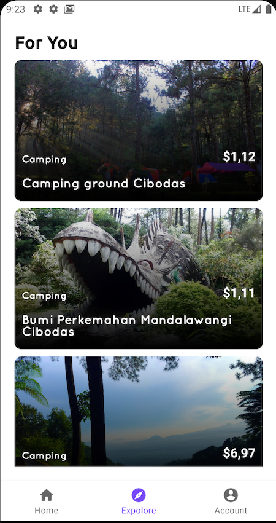

# VirtualTravel
Final Project School in Semester 1

This project work together with my other friends

## In This Project i have learned about
- Glide (Library)
- Recycler view
- import text to android studio platform
- Single Activity with multiple fragments
- Bottom Nav Menu
- Navigation UI
- Custom view Toast Alert

## this is the view

|  |  |
| :--: | :--: |

|  |  |
| :--: | :--: |
